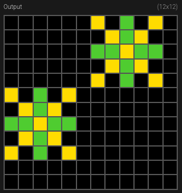

# Introduction to ARC-AGI tasks

In this project we use mainly ARC-AGI 1 dataset. It consists of examples such as

and user is given a completion task like this

User needs to modify the grid size and then color cells using 10 colors (including black).

For humans it is quite intuitive that we need to extend the small star into a bigger star using the colors of the small star. So we can provide the solution

But how can a computer program understand the rules just from the examples?

One way to solve it is to find programs that generate output from the given input. For example,

Find a square that has different (than its own color) color squares on its each four sides

- fill all diagonal squares until distance 2 with its color
- for each four adjacent squares, fill the square behind them with the color of the adjacent square in question

This is not the only program to create the correct output and we cannot know what are the actual rules: Should we check that all four adjacent squares are the same color? Probably but we don't have an example for that.

In this project, we study if concept blending can help us to solve these problems. In this case, such concepts could be rotational symmetry, center, or line (ray). For this, we use MeTTa hypergraph language from Hyperon framework.

Next: [MeTTa language](metta.md)