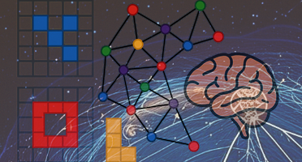

# Pattern Discovery in Symbolic Visual Structures

This project explores concept blending as a mechanism for abstract pattern discovery in symbolic visual structures, with a focus on tasks inspired by the ARC-AGI challenge. We implement an information-theoretic concept blending algorithm within the MeTTa language of the Hyperon framework, targeting the induction of reusable abstractions from small, discrete visual examples. Symbolic visual structures—such as shape groupings, spatial relations, and symmetry patterns—are represented as hypergraphs in the Atomspace. Blending operations generate higher-level concepts that generalize across tasks.

Read the full project proposal from [Deep Funding website](https://deepfunding.ai/proposal/pattern-discovery-in-symbolic-visual-structures/).

Contents:

** Introduction **

&nbsp;&nbsp;&nbsp;&nbsp;[ARC-AGI](intro/arcagi.md)

  * [ARC-AGI-1](intro/arcagi1.md) 
  * [ConceptARC](intro/conceptarc.md)
  * [Mini-ARC](intro/miniarc.md)
  * [1D-ARC](intro/1d-arc.md)
  * [Re-ARC](intro/re-arc.md)
  
&nbsp;&nbsp;&nbsp;&nbsp; [Introduction to MeTTa](intro/metta.md)

&nbsp;&nbsp;&nbsp;&nbsp; [Resources](intro/resources.md)

** Implementation **

&nbsp;&nbsp;&nbsp;&nbsp;Design

  * [Encoding: turning a grid into facts](encoding/encoding-philosophy.md)
  * [Learning the Language of Concepts](encoding/1dstats.md)
  * [Blending two concepts into a third](encoding/simpleblend.md)
  * [The Vocabulary](encoding/vocabulary.md)

&nbsp;&nbsp;&nbsp;&nbsp;The pipeline

  * [The shape of the system](implementation/pipeline1.md)
  * [From grid to candidates](implementation/pipeline2.md)
  * [Choosing pairs](implementation/pipeline3.md)
  * [The generic space](implementation/pipeline4.md)
  * [Building the blend](implementation/pipeline5.md)
  * [Checking the blend holds](implementation/pipeline6.md)
  * [Scoring, and the map of the code](implementation/pipeline7.md)

&nbsp;&nbsp;&nbsp;&nbsp;Verification

  * [What the tests are for](implementation/testing1.md)
  * [Fixtures and properties: the encoder](implementation/testing2.md)
  * [Testing the MeTTa side](implementation/testing3.md)
  * [Corpora and held-out data](implementation/testing4.md)

** Analysis **

  - [Scope and requirements mapping](analysis/analysis1.md)
  - [Coverage of the relational vocabulary](analysis/analysis2.md)
  - [Diversity-based pair selection](analysis/analysis3.md)
  * [Novelty and human evaluation](analysis/analysis4.md)
  * [Negative results and limitations](analysis/analysis5.md)

Documents:

[Literature Review for the Project](Literature review 10022025.pdf)
