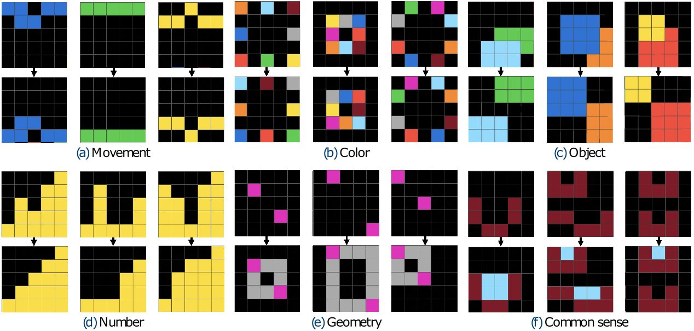

[Main page](../index.md) | [Back to ARC-AGI](arcagi.md)

# Mini-ARC

Mini-ARC is a simplified ARC-like benchmark consisting of small puzzles designed for development and debugging. Authors (Kim et al. 2022) explain the principles of curating these tasks ([https://neurips.cc/media/PosterPDFs/NeurIPS%202022/57706.png](https://neurips.cc/media/PosterPDFs/NeurIPS 2022/57706.png)):

"We invited 25 colleagues for 4 hours to generate novel 5x5 tasks, including at least four input-output pairs, and instructed to build a task with a clear and unique solution. Then, the generated tasks were submitted to the administrator for approval. We pruned around 100 suggested tasks that shared similar concepts during the verification phase and finalized 150 Mini-ARC tasks."

Furthermore, they explain division to six categories:

- Movement tasks are based on dynamic modifications such as flip, rotation, and sliding sideways.
- Color tasks are highly dependent of the color aspect of each pixel, such as swapping colors.
- Object tasks are dependent to the movement of the object or agent, where an object refers to an area that can be intuitively distinguished from the background.
- Number tasks count something, such as the number of pixels of the same color.
- Geometry tasks include problems that require the concept of geometric structures.
- Common-sense tasks, like maze-pathfinder or Tetris, require high-level induction even though they may be intuitively evident to people."

These are illustrated in the following image (source: [https://neurips.cc/media/PosterPDFs/NeurIPS%202022/57706.png](https://neurips.cc/media/PosterPDFs/NeurIPS 2022/57706.png))

## Size and structure

- Total tasks: 149 tasks
- Grid size: All 5x5
- Complexity: Simple, focused transformations
- File format: Same JSON structure as ARC-AGI-1

## Role in this project

Handling different size grids is one of the big challenges with ARC-AGI and ultimately the solver should handle that variable. But for development, this dataset provides tasks that are all 5x5 size so it's great for testing during the development process.

The transformation into a hypergraph can be challenging to comprehend for a human especially in bigger grid sizes. Therefore, 5x5 grid keeps the grid data size small and makes it easier to follow what is happening.

And one step to even simpler grids is 1d-arc presented next. 

Next: [1D-ARC](1d-arc.md)
